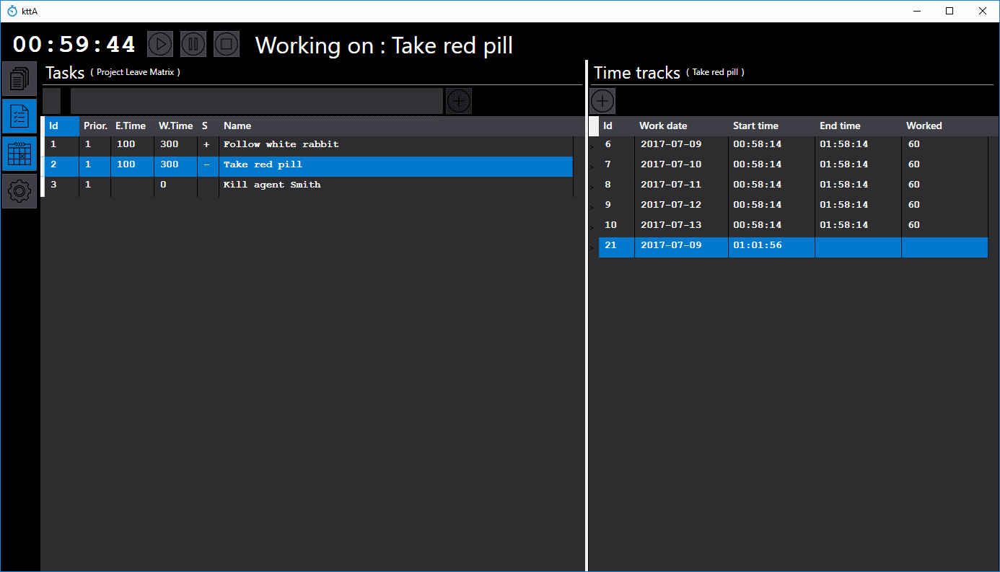
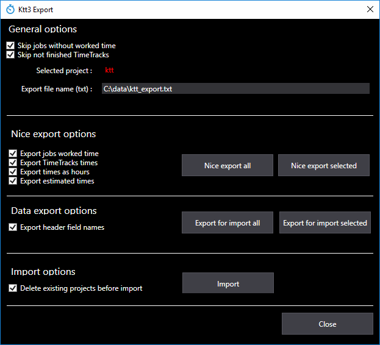
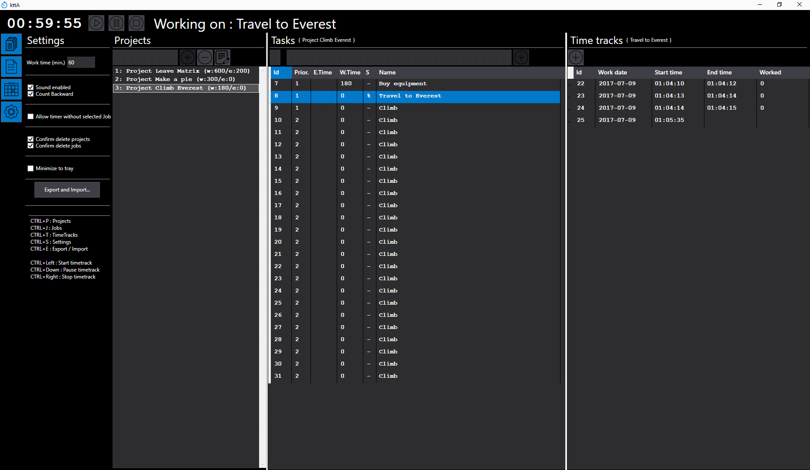
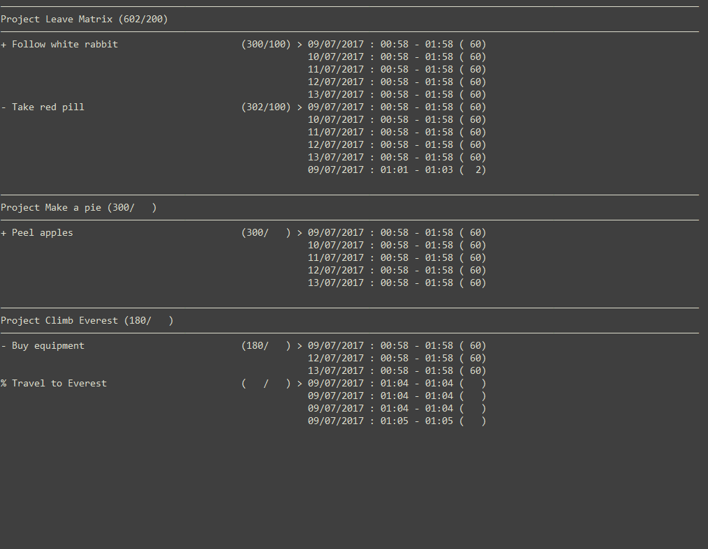
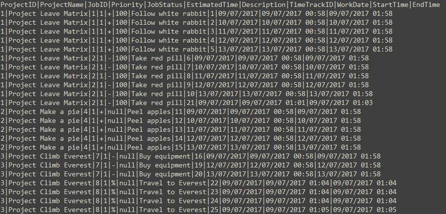

# KissTT (Keep It Simple Stupid Time Tracker)
Project/Task Manager with Pomodoro (sort of) timer

## What is this ?
* This is an extremely simple to use application that controls projects, project tasks and task times with a pomodoro timer

## Glossary 
* WPF = [Windows presentation foundation](https://en.wikipedia.org/wiki/Windows_Presentation_Foundation)
* EF = [Microsoft Entity Framework](https://msdn.microsoft.com/en-us/library/aa937723(v=vs.113).aspx)
* MVVM = [Model View ViewModel pattern](https://en.wikipedia.org/wiki/Model%E2%80%93view%E2%80%93viewmodel)
* CF = [Code first migrations](https://docs.microsoft.com/en-us/aspnet/mvc/overview/getting-started/getting-started-with-ef-using-mvc/creating-an-entity-framework-data-model-for-an-asp-net-mvc-application)

## What is this ? (Long version)
* This is a old app that i wrote mainly to test WPF+EF+MVVM, it eventually becomes the app that i use to manage the tasks and track the times of projects i work
* Initially I was using YAPA [https://github.com/lukaszbanasiak/YAPA](https://github.com/lukaszbanasiak/YAPA) from Lukasz Banasiak, check it out if you want a really nice and minimalistic pomodoro timer i was using it during years, i stop using YAPA only because i wanted to track times in tasks and projects
* Due to this was my first contact with WPF, EF and the MVVM pattern I'm sure there are a lot of things that are not done as they should be done, but works for me, I was fine with WPF/MVVM till I want make CRUD directly in grids at this point things went a little messy and I did not refine it at all
* This is a forever WIP (work in progress) so i keep changing/fixing/adding things as they come to my needs or i get the interest in re-take the app for a while
* I have updated it to work with new versions of EF (6.1.3) and .net (4.5.2), and cleaned up many things before publish it, but due to different views on MVVM and their different ways to implement it I am not sure this is a good example of how to implement MVVM with EF, however I think it could be a guide for someone and even be useful to control their working times, after all I am using it daily

## Features
* Pomodoro timer with configurable time lapses
* Counting time forward and backwards
* A project has <n> tasks that have <n> work times (time tracks)
* You can export data to txt in two ways, a nice (and configurable) one that is the one I usually use to show others, and another (CSV stylish) that exports all the information to be imported later (I use it as a backup and to import in excel)
* You can control Estimated Times, taks's status and priorities, but all of this is optional in fact you can control all or nothing of this things by project because most fields are nullable
* You can use it as a simply timer without tracking projects task or whatever (but if you are going to do this better check YAPA)
* You can minimize to tray or not, the tray icon shows the current pomodoro timer in mouse over tooltip
* You can enable or disable sounds (the sounds are directly stolen from YAPA)
* The app remember all panels open, their widths and working project from last session
* The appearance is ugly as hell ;) 

## How compile
* It's done with Visual Studio 2017 professional, so in theory you must clone and open the .sln and all must work
* Change "mdffiledir" in "App.config" to point wherever you want put your database file, or change the "ktt3Connection" connection string in "App.config" to point directly to it and ignore the |DataDirectory| code & stuff
* Run "Update-Database -ProjectName ktt3 -Verbose -Force" in package manager console for create a start version of EF database (you have several samples in comments in ktt3DbContext.cs)
* Please note that this app use MSSQLLocalDB of SQLServer Express if you don't have it here are the [downloads](https://www.microsoft.com/en-us/download/details.aspx?id=29062) download "SqlLocalDB.MSI" watch there are two versions for x64 and x86 systems
* More info for SqlLocalDB can be located [here](https://docs.microsoft.com/en-us/sql/database-engine/configure-windows/sql-server-2016-express-localdb)

## Issues
* There are some minor issues that i'm to lazy to fix by now, i'm using the app as is for some time and get used to it, nothing annoying (almost for my usual workflow)
  - Sometimes the calculated fields doesn't refresh if you touch data in grid till you touch another record/field, this is due to how EF handles changes inside the collections, there are ways to fix it, but I never need to do it.
  - If the last working proyect is the first in list the jobs doesn't show when you open the app

## Credits & acknowledgments
* The only package that application uses is Hardcodet.NotifyIcon.Wpf, an excellent package of Philipp Sumi [https://bitbucket.org/hardcodet/notifyicon-wpf/](https://bitbucket.org/hardcodet/notifyicon-wpf/) to put WPF applications in the tray icon
* The styles are modified xml files taken from [MahApps](https://github.com/MahApps/MahApps.Metro)
* I have stoled one file from [PRISM](https://msdn.microsoft.com/en-us/library/ff648465.aspx) project, the ones that implements INotifyPropertyChanged, i really like this part of PRISM but I think that use of all Prism library for this tiny app would be overkill
* All icons are from the amazing page [flaticon](http://www.flaticon.com/)
* And of course [stackoverflow](https://stackoverflow.com/) ;)

## Contributing & bug report
* For bug repors use github issues or send me a PM
* In the rare case you want to contribute this, first, are you crazy pal? Please, you must be doing better things :) and second send me a request i will be glad to sum up your contribs
 
## Screenshots
* Here is one of how i usually work :

<table>
    <tr>
        <td>
            
        </td>
    </tr>
</table>

* Here is a screenshot of export & import options :

<table>
    <tr>
        <td>
            
        </td>
    </tr>
</table>

* Here is a screenshot with all panels open :

<table>
    <tr>
        <td>
            
        </td>
    </tr>
</table>

* Here are two screenshots of nice & data export files :

<table>
    <tr>
        <td>
            
        </td>
        <td>
            
        </td>
    </tr>
</table>

